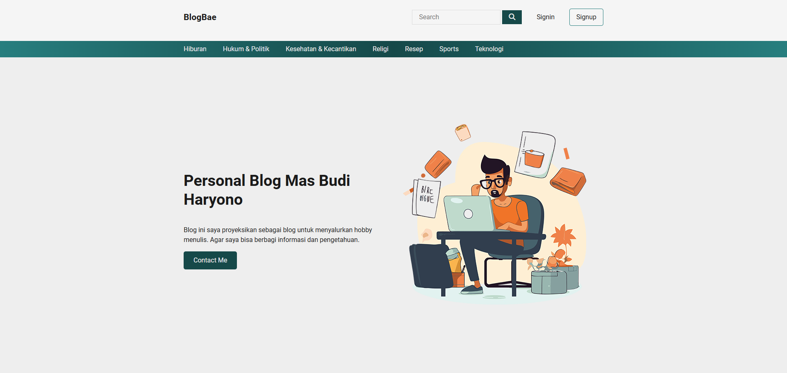

# Blogbae Wordpress Theme

Blogbae is a simple and clean WordPress theme for bloggers especially to use on personal blogs. It is a child theme of the popular Twenty Seventeen theme. Blogbae is a perfect choice for a personal blog, lifestyle blog, fashion blog, photography blog, food blog, travel blog, and many other types of amazing blogs.

## Features
- Clean and minimal design
- Fully responsive layout
- Built in with theme options

## Installation
1. Download
2. Upload to your WordPress site through the admin panel
3. Activate

## License
Blogbae is licensed under the GNU General Public License v2 or later.

## Credits
- [Budi Haryono](https://budiharyono.id)

## Changelog
### 1.0.0
- Initial release

## Support
If you have any questions or need help, feel free to contact me at [budiharyono.id](https://budiharyono.id).

## Screenshots

```